# Account Sharing Detection Model — Alfa-Business

Модель классификации сессий интернет-банка для корпоративных клиентов, определяющая три сценария использования учётной записи: **нормальный доступ владельца**, **доверенный шаринг** (бухгалтер/ассистент) и **компрометация** (несанкционированный доступ). Ensemble из четырёх gradient-boosting моделей достигает **93% accuracy**, **0.89 F1-macro** и **0.94 ROC-AUC** на зашумлённых данных.

---

## Контекст задачи

Альфа-Бизнес — интернет-банк для корпоративных клиентов (3.5 млн компаний, 5.2 млн учётных записей). По оценкам, около 20% аккаунтов используются совместно — владельцы передают логины бухгалтерам, ассистентам или подрядчикам. Это создаёт две проблемы:

- **Безопасность** — невозможно отличить доверенного пользователя от злоумышленника, получившего доступ к учётке.
- **Бизнес** — шаринг маскирует реальную аудиторию и снижает персонализацию сервиса.

Модель классифицирует каждую сессию по трём классам:

| Класс | Описание | Типичный профиль |
|-------|----------|-----------------|
| **0 — Норма** | Владелец аккаунта | Стабильное устройство, привычное время, знакомый IP |
| **1 — Доверенный шаринг** | Бухгалтер/ассистент | Другое устройство, другой навигационный паттерн, высокая энтропия |
| **2 — Компрометация** | Несанкционированный доступ | Новый IP из другого региона, быстрый переход к платежам, новые контрагенты |

---

## Методология: векторизация поведения (Look-A-Like)

В основе детекции лежит принцип **Look-A-Like** — система строит эталонный профиль каждого пользователя и непрерывно сравнивает текущую сессию с этим профилем. Подход опирается на индустриальные практики BioCatch, IBM Trusteer, Capital One и Cleafy.

### Идея

Из одной сессии интернет-банка можно извлечь порядка 2 000 различных поведенческих элементов. Для Альфа-Бизнеса предложены **42 сырые метрики**, сгруппированные в **7 слоёв**:

| Слой | Метрики | Что измеряет | Пример сигнала |
|------|---------|-------------|----------------|
| **1. Временной ритм** (6) | Час входа, день недели, длительность сессии, интервал между сессиями, частота за 7 дней, вход в нерабочее время | Когда и как часто работает пользователь | Директор заходит в 9:00, бухгалтер — в 7:30. Ночной вход от пользователя без истории ночных сессий — аномалия |
| **2. Навигационный почерк** (7) | Число страниц, уникальные разделы, хеш маршрута (embedding), первый раздел, время до первого клика, среднее время на странице, bounce rate | Как именно человек ходит по разделам | Директор → Главная, бухгалтер → Выписки, атакующий → Платежи. Маршрут кодируется через embedding (аналог Word2Vec для страниц) |
| **3. Операционный профиль** (8) | Созданные/подписанные платежи, суммы, контрагенты, новые контрагенты, импорты реестров, скачивания выписок | Что человек делает с деньгами и документами | Бухгалтер создаёт платежи, но не подписывает (sign_ratio ≈ 0). Взломщик подписывает всё сам и быстро (sign_ratio ≈ 1, delta < 40 сек) |
| **4. Behavioral biometrics** (6) | Частота кликов, скорость скролла, энтропия мыши, скорость заполнения форм, доля copy-paste, число пауз | Как физически взаимодействует с интерфейсом | Ботоподобные движения → низкая энтропия мыши. Бухгалтеры часто вставляют ИНН/КПП через copy-paste |
| **5. Устройство и сеть** (7) | Тип устройства, ОС, browser fingerprint, разрешение экрана, IP-подсеть, город, VPN-детекция | С какого устройства и откуда пришёл | 1920×1080 в офисе vs 1440×900 дома. VPN сам по себе не аномалия, но усиливает другие сигналы |
| **6. Контекст и сезонность** (4) | Налоговый дедлайн, зарплатное окно, возраст аккаунта, общее число сессий | Какие внешние условия объясняют активность | Ночная работа бухгалтера в налоговый период — норма, а не аномалия. При < 8 сессиях профиль ещё не калиброван |
| **7. Межсессионная динамика** (4) | Стабильность вектора за 7 дней, доля новых навигационных паттернов, частота смены устройств, параллельные сессии | Как поведение меняется от сессии к сессии | Стабильный cosine_dist = один человек, «прыгающий» = двое под одной учёткой |

### Как из 42 метрик получается вектор

```
Сессия → Вектор (42 числа) → Сравнение с эталоном → vector_cosine_dist + behavior_cluster_shift
```

**Шаг 1 — Агрегация.** Каждая сессия превращается в вектор из 42 числовых значений. Категориальные признаки кодируются через learned embeddings (обучаемые в рамках автоэнкодера) или one-hot.

**Шаг 2 — Формирование эталона.** Эталонный вектор пользователя = экспоненциально-взвешенное скользящее среднее по последним 30 сессиям. Свежие сессии имеют больший вес. Технически Capital One кодирует последовательность сессий через seq2seq автоэнкодеры для полного представления скрытых намерений пользователя.

**Шаг 3 — Вычисление метрик отклонения.**
- `vector_cosine_dist = 1 − cosine_similarity(session_vector, user_reference_vector)` — единое число отклонения текущей сессии от эталона
- `behavior_cluster_shift = euclidean_distance(session_vector, cluster_centroid)` — расстояние до центроида кластера (K-Means по историческим сессиям). Если пользователь «раздваивается», появляется два кластера, и shift растёт для обоих

**Шаг 4 — Обновление.** Если сессия признана нормальной (класс 0), эталонный вектор обновляется. Если аномальная — не обновляется, чтобы не «отравить» профиль.

### Связь с текущей моделью

В данном проекте из полного вектора (42 метрики) используются **15 агрегированных признаков**, покрывающих все 7 слоёв. Два ключевых признака — `vector_cosine_dist` и `behavior_cluster_shift` — являются выходом описанного пайплайна векторизации и дают **~25% вклада** в решение модели. Полная спецификация 42 метрик доступна в [`reports/`](reports/).

---

## Данные

**1 000 сессий, 15 признаков**, разбитых на 5 функциональных блоков:

| Блок | Признаки | Что отражает |
|------|----------|-------------|
| Технический | `device_fingerprint_match`, `ip_new_for_account`, `geo_velocity_kmh`, `unique_devices_30d` | Устройства и сетевой контекст |
| Поведенческий | `section_entropy`, `professional_alien_index`, `session_start_std_dev` | Навигационные паттерны |
| Операционный | `sign_ratio`, `draft_to_sign_time_delta`, `new_counterparty_volume_ratio` | Финансовые действия |
| Метрики отклонения | `vector_cosine_dist`, `behavior_cluster_shift` | Расстояние до эталонного профиля |
| Контекст | `is_tax_period`, `concurrent_sessions`, `os_browser_combo` | Внешние факторы |

Распределение классов: **666 / 232 / 102** (Норма / Шаринг / Компрометация) — несбалансированная выборка, балансировка через SMOTE.

### Зашумление данных: от 100% к реалистичным метрикам

Исходный синтетический датасет (`alfa_business_comprehensive_dataset.xlsx`) давал **100% accuracy** на всех моделях — признаки идеально разделяли классы без перекрытий. Это нереалистично для продакшн-сценария.

Для имитации реальных условий в данные были внесены **целенаправленные помехи** (`alfa_business_noisy_dataset.xlsx`):

- **Гауссов шум** в числовых признаках — размытие границ между классами
- **Случайные перевороты бинарных флагов** (`device_fingerprint_match`, `ip_new_for_account`) — имитация VPN, командировок, смены устройств
- **Амбивалентные строки** — сессии с признаками от нескольких классов одновременно (бухгалтер на устройстве владельца, владелец в нетипичное время)
- **Шум в метках** (~5%) — имитация ошибок разметки
- **Персонализация по аккаунтам** — разные пользователи демонстрируют разные базовые паттерны

Это снизило accuracy до реалистичных **92–93%** и создало характерные зоны перекрытия между классами.

---

## Пайплайн

```
Данные → Предобработка → SMOTE → Optuna → 4 модели → Soft Voting Ensemble
```

1. **Предобработка** — заполнение пропусков медианой, one-hot кодирование `os_browser_combo`, стандартизация числовых признаков
2. **Балансировка** — SMOTE внутри каждого fold при кросс-валидации (без утечки данных)
3. **Оптимизация** — Optuna (10 итераций, 2-fold CV) для каждой из четырёх моделей
4. **Ансамбль** — Soft Voting из RandomForest, XGBoost, LightGBM, CatBoost

---

## Результаты

### Сравнение моделей (holdout 20%)

| Модель | Accuracy | F1-macro | ROC-AUC |
|--------|----------|----------|---------|
| RandomForest | **0.930** | **0.895** | 0.942 |
| XGBoost | 0.925 | 0.885 | 0.943 |
| LightGBM | 0.920 | 0.882 | **0.945** |
| CatBoost | 0.920 | 0.881 | 0.944 |
| **Ensemble** | **0.930** | 0.890 | 0.941 |

<p align="center">
  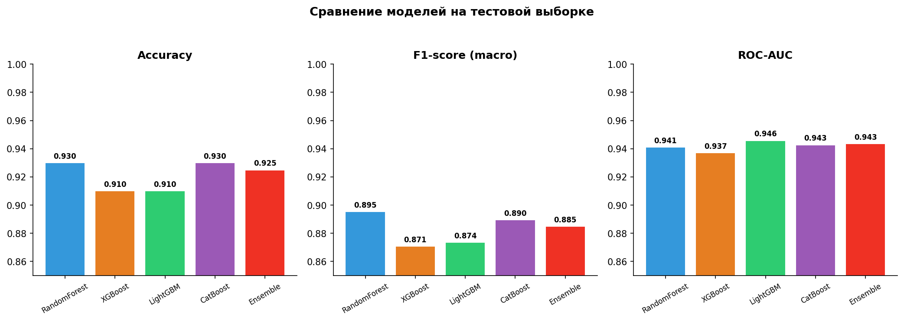
</p>

### Детализация по классам (Ensemble)

| Класс | Precision | Recall | F1-score | Support |
|-------|-----------|--------|----------|---------|
| Норма (0) | 0.949 | 0.977 | 0.963 | 133 |
| Шаринг (1) | 0.907 | 0.848 | 0.876 | 46 |
| Компрометация (2) | 0.850 | 0.810 | 0.829 | 21 |

<p align="center">
  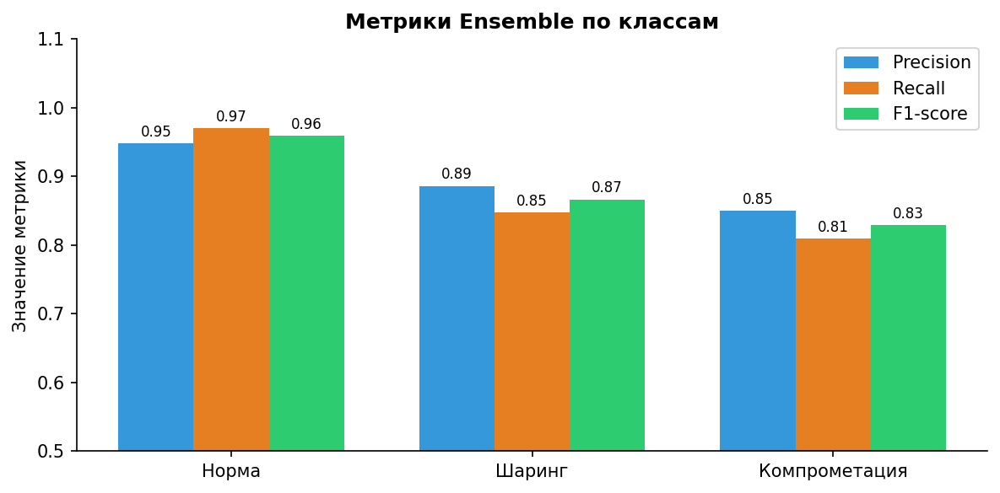
  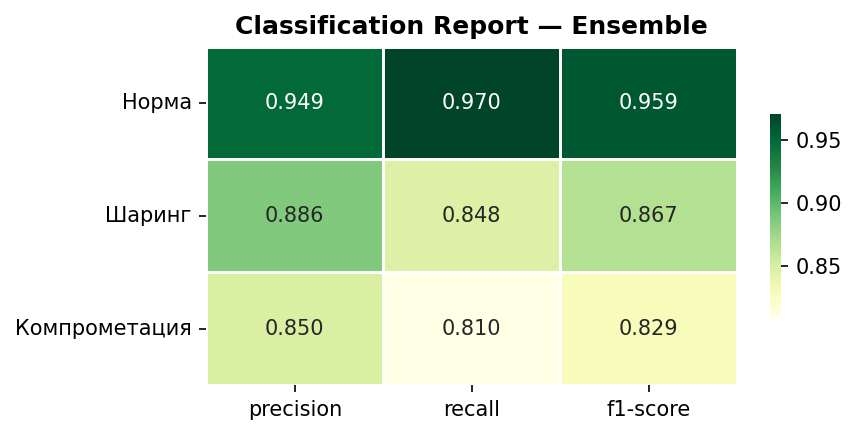
</p>

### Confusion Matrix

<p align="center">
  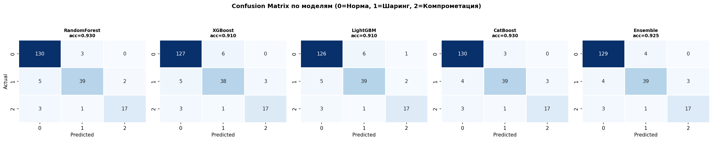
</p>

### Ключевые выводы

- **Класс 0 (Норма)** детектируется лучше всего (F1 = 0.963) — стабильные паттерны владельцев хорошо выучиваются
- **Класс 1 (Шаринг)** — Precision 0.907 при Recall 0.848. Часть случаев шаринга неотличима от нормы (бухгалтер на привычном устройстве в офисе)
- **Класс 2 (Компрометация)** — самый сложный (F1 = 0.829). При малом количестве примеров модель ловит 81% атак с 85% точностью
- **Переобучения нет** — расхождение holdout и 5-fold CV в пределах 1 п.п.

### Проверка на переобучение

<p align="center">
  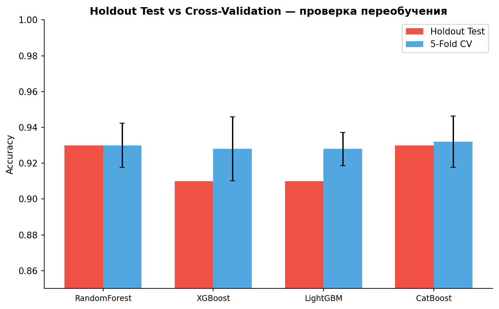
</p>

---

## EDA

### Корреляция признаков с целевой переменной

Наиболее информативные признаки — `vector_cosine_dist`, `behavior_cluster_shift`, `new_counterparty_volume_ratio` и `session_start_std_dev`.

<p align="center">
  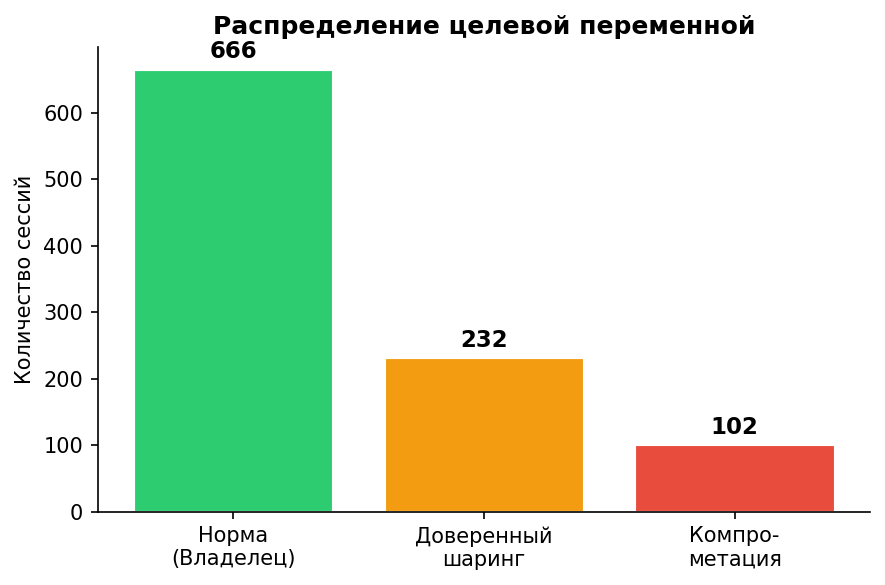
  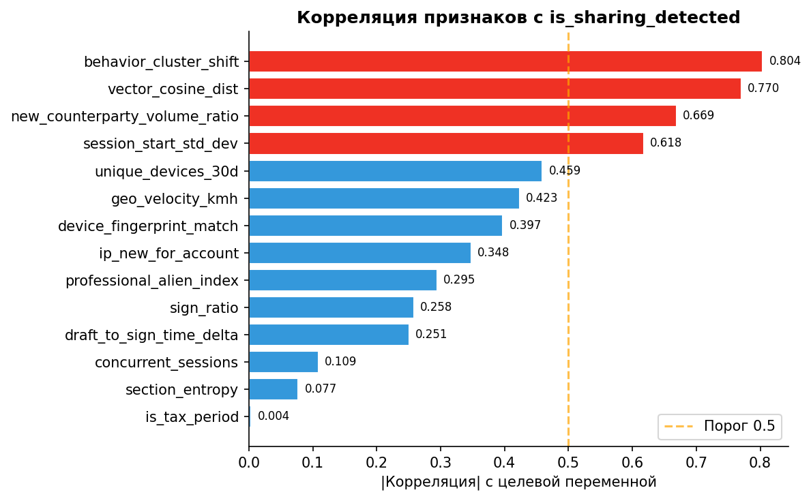
</p>

### Матрица корреляций и распределения по классам

<p align="center">
  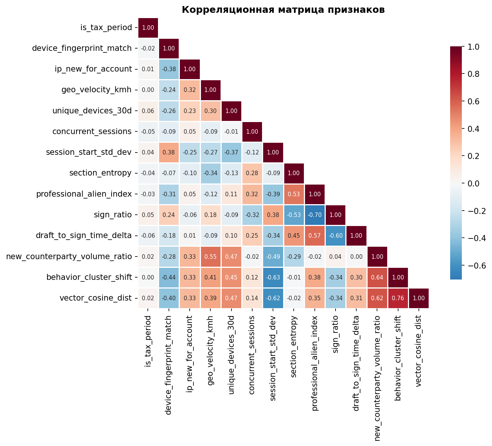
  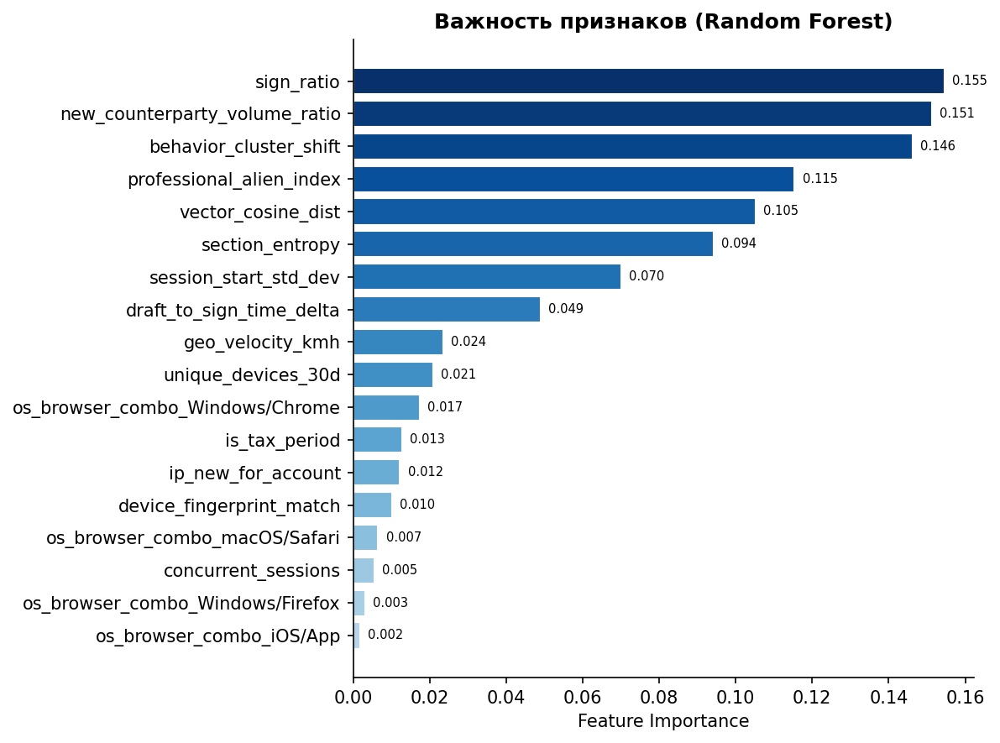
</p>

<p align="center">
  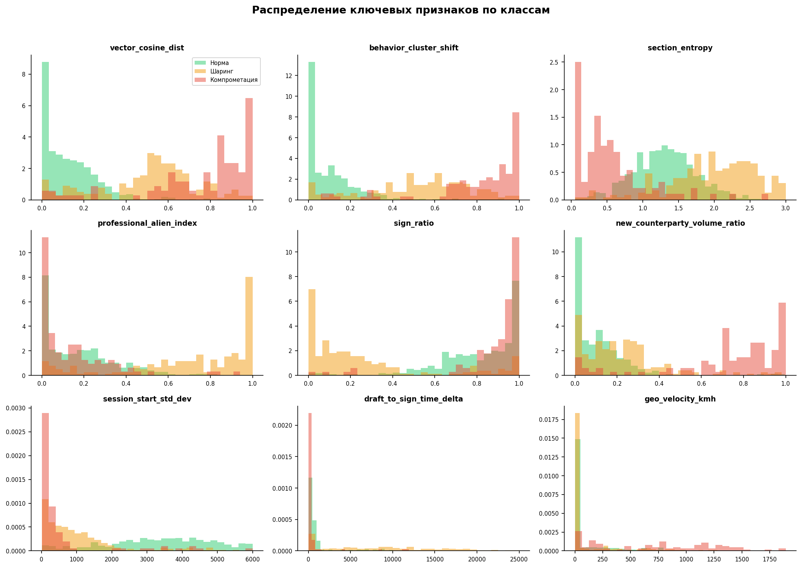
  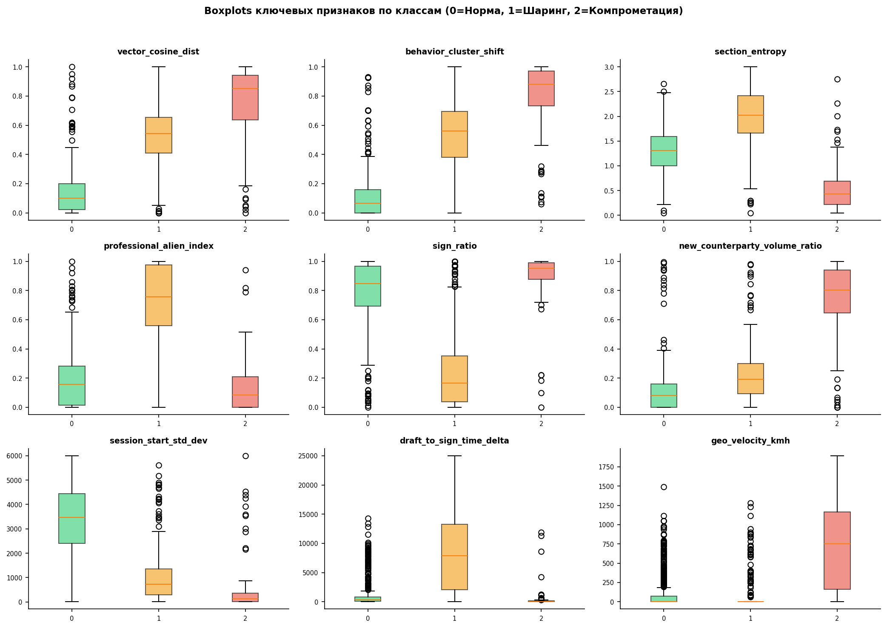
</p>

### ROC и Precision-Recall кривые

<p align="center">
  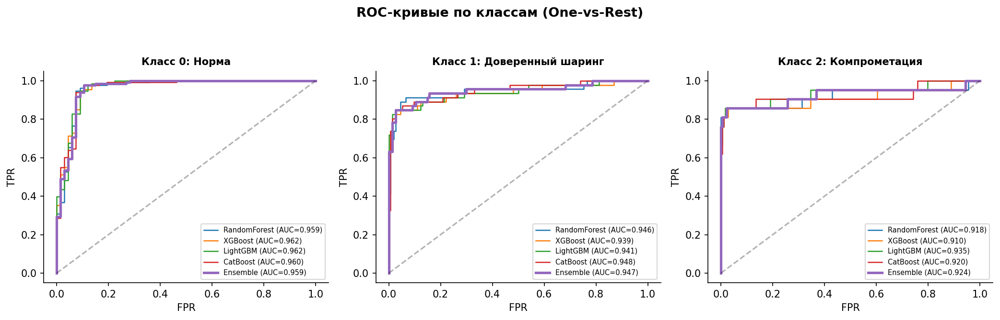
  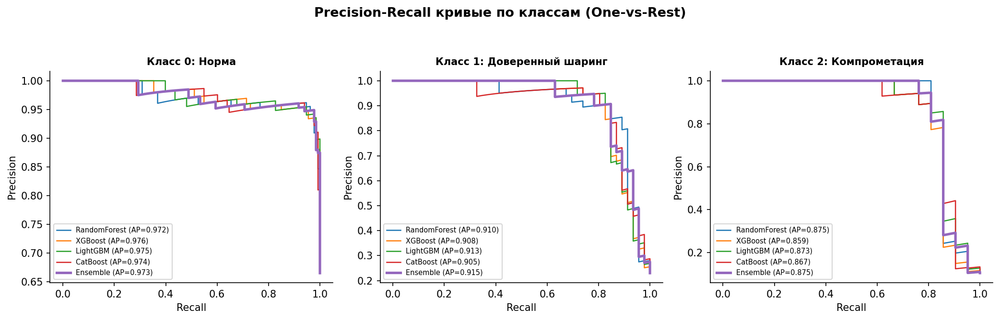
</p>

---

## Важность признаков (Топ-5)

1. **vector_cosine_dist** — отклонение вектора текущей сессии от эталонного профиля. Агрегированная метрика, объединяющая множество сигналов
2. **behavior_cluster_shift** — смещение поведения относительно исторического центра. Маркер «двух пользователей под одной учёткой»
3. **section_entropy** — разнообразие посещённых разделов. Бухгалтеры (класс 1) — высокая энтропия, боты/взломщики (класс 2) — низкая
4. **professional_alien_index** — скорость перехода к глубоким разделам, минуя главную. Высокий индекс — почерк аутсорс-бухгалтера
5. **draft_to_sign_time_delta** — время между созданием черновика и подписью. Большие разрывы характерны для передачи учётки

---

## Бизнес-применение

Модель поддерживает три уровня реагирования:

| Сценарий | Условие | Действие |
|----------|---------|----------|
| Мягкое уведомление | Класс 1, P > 0.6 | Soft-нотификация владельцу с предложением подключить бухгалтера отдельно |
| Усиленная верификация | Класс 2, P > 0.5 | Запрос SMS-кода перед финансовыми операциями |
| Блокировка сессии | Класс 2, P > 0.85 | Немедленная блокировка + уведомление владельца |

---

## Структура репозитория

```
account-sharing-detection/
├── README.md
├── requirements.txt
├── .gitignore
├── LICENSE
├── notebooks/
│   └── CUP_IT_26_Final.ipynb       # Полный пайплайн: генерация данных → EDA → моделирование
├── data/
│   ├── alfa_business_comprehensive_dataset.xlsx   # Чистый синтетический датасет
│   └── alfa_business_noisy_dataset.xlsx           # Зашумлённый датасет (используется в модели)
├── plots/                           # Все графики из ноутбука (13 визуализаций)
│   ├── 01_target_distribution.png
│   ├── 02_feature_correlation.png
│   ├── ...
│   └── 13_classification_report_heatmap.png
└── reports/
    ├── Модель_детекции_шаринга_учётных_записей_Альфа-Бизнеса.pdf   # PDF-отчёт по модели
    └── Как_устроена_векторизация_поведения_пользователя.pdf         # Методология Look-A-Like
```

---

## Запуск

```bash
git clone https://github.com/<your-username>/account-sharing-detection.git
cd account-sharing-detection
pip install -r requirements.txt
jupyter notebook notebooks/CUP_IT_26_Final.ipynb
```

---

## Стек технологий

**ML/DS:** scikit-learn, XGBoost, LightGBM, CatBoost, imbalanced-learn (SMOTE), Optuna  
**Данные:** pandas, NumPy, openpyxl  
**Визуализация:** matplotlib, seaborn  
**Среда:** Jupyter Notebook, Python 3.10+

---

## Навыки, применённые в проекте

- **Мультиклассовая классификация** на несбалансированных данных с SMOTE-балансировкой внутри кросс-валидации
- **Feature engineering** — проектирование 15 признаков в 5 функциональных блоках с бизнес-обоснованием каждого
- **Проектирование системы векторизации поведения** — Look-A-Like подход: 42 метрики в 7 слоях, эталонные профили, cosine distance + cluster shift
- **Hyperparameter tuning** — Optuna с кросс-валидацией для четырёх моделей
- **Ensemble methods** — Soft Voting Classifier из RandomForest + XGBoost + LightGBM + CatBoost
- **Оценка качества** — confusion matrix, ROC-AUC (OvR), Precision-Recall кривые, проверка на переобучение (holdout vs CV)
- **Реалистичное зашумление данных** — создание синтетического датасета с контролируемыми помехами для имитации продакшн-условий
- **Бизнес-ориентированная интерпретация** — три уровня реагирования с настраиваемыми порогами, прогноз метрик на 6 месяцев
- **EDA и визуализация** — 13 графиков: распределения, корреляции, boxplots, ROC/PR-кривые, heatmaps
- **Работа с gradient boosting фреймворками** — XGBoost, LightGBM, CatBoost в едином пайплайне

---

## Лицензия

Этот проект распространяется под лицензией [CC BY-NC-SA 4.0](https://creativecommons.org/licenses/by-nc-sa/4.0/).
